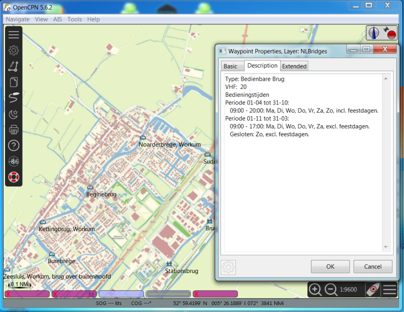
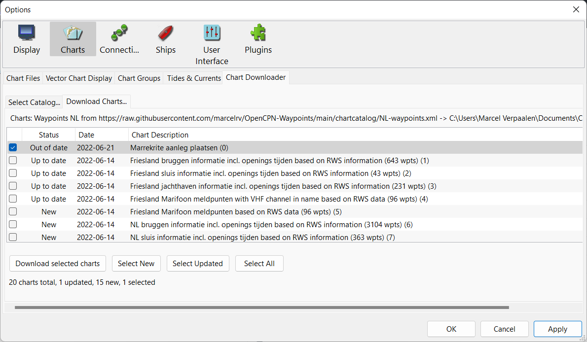

# OpenCPN-Waypoints

## GPX Files for OpenCPN

### Dutch files (bruggen, sluizen, marifoon & jachthavens gebaseerd op RWS / vaarweginformatie.nl data)
* [Frieslandboeien.gpx](Frieslandboeien.gpx) - Boeien in Friesland als GPX (bron: provincie Friesland). Note: gebruik de [usericons](./chartcatalog/usericons.zip)  anders zie je alleen circels
* [marrekrite.gpx](marrekrite.gpx)  - Alle marrekritten aanlegplaatsen for use with OpenCPN. Import as Layer so it can be easily switched on/off
* [Friesland-Bruggen.gpx](Friesland-Bruggen.gpx) - Alle Friese bruggen met openingstijden en marifoon kanaal
* [Friesland-Sluizen.gpx](Friesland-Sluizen.gpx) -Alle Friese sluizen met openingstijden en marifoon kanaal
* [Friesland-Jachthavens.gpx](Friesland-Jachthavens.gpx) - Jachthavens in Friesland
* [Friesland-MarifoonPunten-VHFinName.gpx](Friesland-MarifoonPunten-VHFinName.gpx) - Marifoon meldpunten met kanaal in de naam om snel te zien in de map (check 'Show WPT Name')
* [Friesland-MarifoonPunten.gpx](Friesland-MarifoonPunten.gpx) - Marifoon meldpunten Friesland
* [NL-Bruggen.gpx](NL-Bruggen.gpx) - Alle Nederlandse bruggen met openingstijden en marifoon kanaal 
* [NL-Sluizen.gpx](NL-Sluizen.gpx) - Alle Nederlandse sluizen met openingstijden en marifoon kanaal 
* [NL-Jachthavens.gpx](NL-Jachthavens.gpx) - Jachthavens in Friesland
* [NL-MarifoonPunten-VHFinName.gpx](NL-MarifoonPunten-VHFinName.gpx) - Marifoon meldpunten met kanaal in de naam om snel te zien in de map (check 'Show WPT Name')
* [NL-MarifoonPunten.gpx](NL-MarifoonPunten.gpx) - Marifoon meldpunten Friesland

### Belgium & France (note based on information provided by RWS / vaarweginformatie.nl )
* [BE-Bruggen.gpx](BE-Bruggen.gpx) - Belgische bridges
* [BE-Sluizen.gpx](BE-Sluizen.gpx) - Belgium locks
* [FR-Bruggen.gpx](FR-Bruggen.gpx) - France bridges
* [FR-Sluizen.gpx](FR-Sluizen.gpx) - France locks

### Germany, Austria & Swiss (note based on information provided by RWS / vaarweginformatie.nl )
* [DE-Bruggen.gpx](DE-Bruggen.gpx) - German bridges
* [DE-Sluizen.gpx](DE-Sluizen.gpx) - German locks
* [AT-Bruggen.gpx](AT-Bruggen.gpx) - Austria bridges
* [AT-Sluizen.gpx](AT-Sluizen.gpx) - Austria locks
* [CH-Bruggen.gpx](CH-Bruggen.gpx) - Swiss bridges

## Easy Update in OpenCPN

To support easy downloading of the latest files add the following URL to the Chart Downloader plugin:
[https://raw.githubusercontent.com/marcelrv/OpenCPN-Waypoints/main/NL-waypoints.xml](https://raw.githubusercontent.com/marcelrv/OpenCPN-Waypoints/main/NL-waypoints.xml)  
Note that you still need to (manually) import the waypoints in the Route and Marks manager.

## Tools
* [marrekritten_to_GPX.py](marrekritten_to_GPX.py) - File to automatically create marrekrite.gpx from the https://www.marrekrite.frl website.  
To update run `python3 marrekritten_to_GPX.py`

* [vwi_waypoints_generator.py](vwi_waypoints_generator.py) - File to automatically create the bridges, locks, radio and harbours gpx files from the public data of Rijkswaterstaat on https://www.vaarweginformatie.nl/  
To update run `python3 vwi_waypoints_generator.py` to update files when no update is availabe from https://www.vaarweginformatie.nl/ run it with any argument e.g. `python3 vwi_waypoints_generator.py  -force`

* [frieslandBoeien_generator.py](frieslandBoeien_generator.py)  - File to automatically Friesland Boeien based on data from provincie Friesland

Requires gpxpy, you can install this with `pip3 install gpxpy` or alternatively `pip3 install -r requirements.txt`

## Copyright
Provided GPX files have CC BY-NC-SA 4.0 licence... so share them, copy them, edit them... just don't sell them. They are here all free of charge.
Location data provided in these files is based on public data.

## Warranty
Though provided GPX files are generated based on formally published data from respective authorities, they are explicitly provided “AS IS” without express or implied warranties, guarantees, or guarantees of correctness. So USE THEM AT YOUR OWN RISK!
Having said that... <B>HAPPY SAILING<B>
